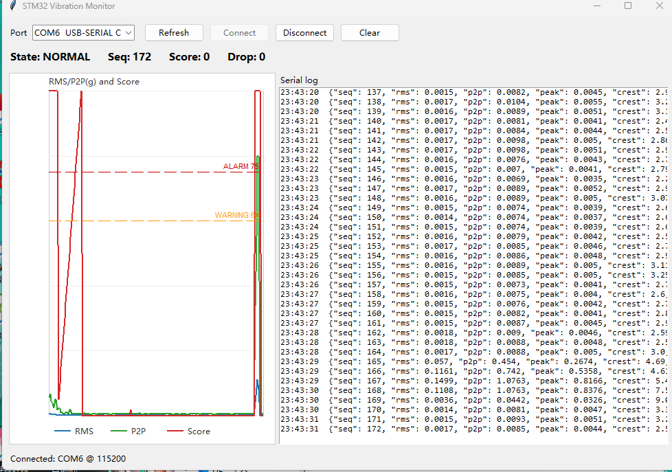

# STM32-FreeRTOS Vibration Anomaly Monitor

基于 STM32F103C8T6、MPU6050、FreeRTOS 和 Python 上位机的低成本振动异常检测终端。项目不是简单读取传感器数值，而是实现了固定周期采样、滑动窗口特征提取、自学习基线、异常评分、状态机报警、任务级看门狗和 PC 端实时可视化。



## 项目亮点

- **FreeRTOS 多任务架构**：采样、特征计算、异常检测、串口通信、看门狗监控分任务运行，通过队列和任务通知解耦。
- **自学习基线检测**：系统上电后先学习正常振动基线，再用 RMS、峰峰值、峰值因子与基线比值计算异常分数。
- **抗抖动状态机**：通过连续异常窗口和连续恢复窗口控制 NORMAL / WARNING / ALARM 切换，降低偶发噪声误报。
- **任务级看门狗设计**：不是任意位置喂狗，而是每个关键任务更新心跳，只有所有任务健康时才刷新 IWDG。
- **Python/Tkinter 上位机**：通过 pyserial 接收 STM32 输出的 JSON 数据，实时显示 RMS、P2P、Score 曲线和原始串口日志。
- **低成本硬件实现**：核心硬件只需要 STM32F103C8T6、MPU6050 和 USB-TTL。

## 系统架构

```text
MPU6050
  -> I2C1 读取 ax/ay/az
  -> 三轴合加速度模长 sqrt(ax^2 + ay^2 + az^2)
  -> 环形缓冲区保存最近 128 个采样点
  -> 每 64 个新点触发一次滑动窗口分析
  -> 去均值后计算 RMS / P2P / Peak / Crest
  -> 前 20 个窗口学习正常基线
  -> 当前特征与基线比较，计算异常分数
  -> 状态机输出 LEARNING / NORMAL / WARNING / ALARM
  -> USART1 输出 JSON
  -> Python 上位机实时显示曲线
```

## 硬件连接

| 模块 | 引脚 | STM32F103C8T6 | 说明 |
|---|---|---|---|
| MPU6050 | VCC | 3.3V | 建议使用 3.3V |
| MPU6050 | GND | GND | 必须共地 |
| MPU6050 | SCL | PB6 / I2C1_SCL | CubeMX 配置 I2C1 |
| MPU6050 | SDA | PB7 / I2C1_SDA | CubeMX 配置 I2C1 |
| MPU6050 | AD0 | GND 或悬空 | 地址为 0x68 |
| USB-TTL | RXD | PA9 / USART1_TX | STM32 发送到电脑 |
| USB-TTL | TXD | PA10 / USART1_RX | 电脑发送到 STM32 |
| USB-TTL | GND | GND | 必须共地 |

## 软件环境

- STM32CubeMX
- Keil MDK-ARM 5
- STM32Cube FW_F1
- Python 3
- Python package: `pyserial`

安装 Python 上位机依赖：

```bash
python -m pip install pyserial
```

## 工程目录

```text
Core/          CubeMX 生成的主程序、外设初始化和 FreeRTOS 配置
Drivers/       STM32 HAL / CMSIS 驱动
Middlewares/   FreeRTOS 源码
User/          振动检测应用层代码
Tools/         Python 上位机
docs/          项目截图和说明素材
zhendong.ioc   CubeMX 工程
MDK-ARM/       Keil 工程
```

## 核心代码说明

| 文件 | 作用 |
|---|---|
| `User/app_config.h` | 采样率、窗口长度、阈值、任务栈、看门狗参数 |
| `User/mpu6050.c/.h` | MPU6050 I2C 初始化和加速度读取 |
| `User/vib_ring_buffer.c/.h` | 固定内存环形缓冲区 |
| `User/vib_feature.c/.h` | 合加速度、RMS、P2P、Peak、Crest 特征计算 |
| `User/vib_detect.c/.h` | 自学习基线、异常评分、状态机 |
| `User/vib_comm.c/.h` | UART JSON 输出 |
| `User/app_vibration.c/.h` | FreeRTOS 任务创建和主业务流程 |
| `Tools/vibration_tk_viewer.py` | Python 上位机 |

## 异常评分逻辑

系统前 20 个窗口处于 `LEARNING` 状态，用增量平均法学习正常基线：

```c
base = base + (current - base) / count;
```

学习结束后，计算当前特征相对基线的增长比例。只有超过基线的部分参与评分：

```c
score = 45 * positive_delta(rms_ratio)
      + 40 * positive_delta(p2p_ratio)
      + 15 * positive_delta(crest_ratio);
```

其中：

- RMS 权重较高，用来描述整体振动能量。
- P2P 用来描述冲击幅度。
- Crest 用来补充识别短时尖峰冲击。
- 分数限制在 0 到 100，便于上位机显示和阈值判断。

## FreeRTOS 任务设计

| 任务 | 职责 | 关键机制 |
|---|---|---|
| SensorTask | 200 Hz 读取 MPU6050，写入环形缓冲区 | `vTaskDelayUntil` |
| ProcessTask | 复制滑动窗口并计算特征 | 任务通知 |
| DetectTask | 学习基线、计算分数、更新状态机 | FreeRTOS Queue |
| CommTask | UART 输出 JSON | FreeRTOS Queue |
| WatchdogTask | 检查任务心跳并刷新 IWDG | 任务级心跳 |

## 串口输出示例

```json
{"seq":172,"rms":0.0017,"p2p":0.0085,"peak":0.0044,"crest":2.58,"score":0,"state":"NORMAL","drop":0}
```

字段含义：

- `seq`：分析窗口序号
- `rms`：振动有效值
- `p2p`：峰峰值
- `peak`：峰值
- `crest`：峰值因子
- `score`：异常分数
- `state`：当前状态
- `drop`：队列满导致丢弃的窗口数量

## Python 上位机运行

进入 `Tools` 目录，运行：

```bash
python vibration_tk_viewer.py
```

也可以在 Windows 下双击：

```text
Tools/run_vibration_viewer.bat
```

操作步骤：

1. 插入 USB-TTL，确认设备管理器中出现 COM 口。
2. 打开 Python 上位机。
3. 选择对应 COM 口，例如 COM6。
4. 点击 `Connect`。
5. 复位 STM32。
6. 观察 Serial log 和 RMS/P2P/Score 曲线。

## 如何复现实验

1. 使用 CubeMX 打开 `zhendong.ioc`，确认 I2C1、USART1、FreeRTOS 配置。
2. 使用 Keil 打开 `MDK-ARM/zhendong.uvprojx`。
3. 编译并下载到 STM32F103C8T6。
4. 按硬件连接表接好 MPU6050 和 USB-TTL。
5. 打开 Python 上位机并连接 COM 口。
6. 静置传感器完成基线学习。
7. 轻敲或振动 MPU6050，观察 Score 和状态变化。

## 面试可讲点

- 为什么采样任务要用 `vTaskDelayUntil`，而不是普通 `vTaskDelay`。
- 为什么使用环形缓冲区而不是每次移动数组。
- 为什么先对窗口数据去均值，再计算 RMS/P2P。
- 为什么使用自学习基线，而不是固定阈值。
- 为什么状态机要加入报警保持和恢复保持。
- 为什么采用任务级看门狗，而不是任意任务直接喂狗。
- 为什么上位机只负责可视化，检测算法仍在 STM32 端完成。

## 后续可扩展方向

- 使用 CMSIS-DSP 加入 FFT 频域特征。
- 使用 DMA + 空闲中断优化串口通信。
- 将基线参数保存到 Flash，实现断电保持。
- 增加 OLED 本地显示和蜂鸣器报警。
- 接入 ESP8266/ESP32 或 MQTT，实现远程监测。

